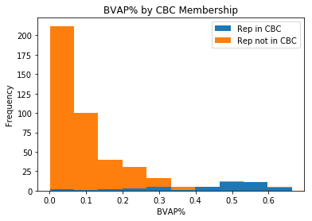
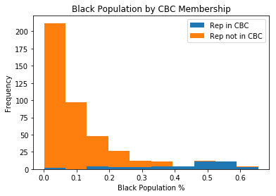

# BVAP and Membership in the Congressional Black Caucus

In this notebook, we explore the relationship between the Black Voting Age Population (BVAP) of a congressional district and whether or not that district is represented by a member of the Congressional Black Caucus.

Data on Citizen Voting Age Population is drawn from [the 2012-2016 American Community Survey 5 year Estimates](https://www.census.gov/programs-surveys/decennial-census/about/voting-rights/cvap.html). The relevant file, `CD.csv`, is included in this repository for convenience.

Data on Congressional Black Caucus membership (`cbc.csv`) was parsed from the [Wikipedia article](https://en.wikipedia.org/wiki/Congressional_Black_Caucus#Membership) for the Congressional Black Caucus (accessed 10/9/2018). We added Rep. John Conyers (who represented Michigan's 13th Congressional District until 2017) to the dataset to reflect the Caucus's membership after the 2016 election.

## Preprocessing

The `tidy.py` script extracts the relevant data from `CD.csv` to `cvap.csv` and parses the GEOIDs of the congressional districts listed in `cbc.csv`.

## Join

As our final data manipulation step, we join the CBC membership data in `cbc.csv` with the demographic data in `cvap.csv` to produce `data.csv`.

```python
import pandas
import matplotlib.pyplot
```

```python
cbc = pandas.read_csv("./cbc.csv")
cvap = pandas.read_csv("./cvap.csv")
```

```python
cbc_geoids = set(cbc["GEOID"])

cvap["is_in_cbc"] = cvap["GEOID"].apply(lambda geoid: geoid in cbc_geoids)

cvap.to_csv("./data.csv")
```

## Plots

```python
bvap_cbc_df = pandas.DataFrame({
    "Rep in CBC": cvap[cvap["is_in_cbc"]]["bvap_pct"],
    "Rep not in CBC": cvap[cvap["is_in_cbc"] == False]["bvap_pct"]
})
```

```python
plot = bvap_cbc_df.plot.hist(stacked=True)
plot.set_xlabel("BVAP%")
plot.set_title("BVAP% by CBC Membership")
```

    Text(0.5,1,'BVAP% by CBC Membership')



```python
black_pct_df = pandas.DataFrame({
    "Rep in CBC": cvap[cvap["is_in_cbc"]]["black_pct"],
    "Rep not in CBC": cvap[cvap["is_in_cbc"] == False]["black_pct"]
})

plot = black_pct_df.plot.hist(stacked=True)
plot.set_xlabel("Black Population %")
plot.set_title("Black Population by CBC Membership")
```

    Text(0.5,1,'Black Population by CBC Membership')



## Districts with BVAP > 37%

The 37% BVAP level is an important cutoff point in this dataset. 91.4% of congressional districts with a BVAP of 37% or greater is represented by a member of the Congressional Black Caucus.

```python
high_bvap = cvap[cvap["bvap_pct"] >= 0.37]
high_bvap
```

<table border="1" class="dataframe">
  <thead>
    <tr style="text-align: right;">
      <th></th>
      <th>GEOID</th>
      <th>display_name</th>
      <th>bvap</th>
      <th>cvap</th>
      <th>bvap_pct</th>
      <th>black_pop</th>
      <th>total_pop</th>
      <th>black_pct</th>
      <th>is_in_cbc</th>
    </tr>
  </thead>
  <tbody>
    <tr>
      <th>6</th>
      <td>50000US0107</td>
      <td>Congressional District 7 (115th Congress), Ala...</td>
      <td>318590</td>
      <td>513355</td>
      <td>0.620604</td>
      <td>427850</td>
      <td>675230</td>
      <td>0.633636</td>
      <td>True</td>
    </tr>
    <tr>
      <th>87</th>
      <td>50000US1198</td>
      <td>Delegate District (at Large) (115th Congress),...</td>
      <td>237930</td>
      <td>494090</td>
      <td>0.481552</td>
      <td>313680</td>
      <td>659010</td>
      <td>0.475987</td>
      <td>False</td>
    </tr>
    <tr>
      <th>92</th>
      <td>50000US1205</td>
      <td>Congressional District 5 (115th Congress), Flo...</td>
      <td>239950</td>
      <td>529155</td>
      <td>0.453459</td>
      <td>335655</td>
      <td>718315</td>
      <td>0.467281</td>
      <td>True</td>
    </tr>
    <tr>
      <th>107</th>
      <td>50000US1220</td>
      <td>Congressional District 20 (115th Congress), Fl...</td>
      <td>235265</td>
      <td>459945</td>
      <td>0.511507</td>
      <td>395580</td>
      <td>752660</td>
      <td>0.525576</td>
      <td>True</td>
    </tr>
    <tr>
      <th>111</th>
      <td>50000US1224</td>
      <td>Congressional District 24 (115th Congress), Fl...</td>
      <td>223910</td>
      <td>443490</td>
      <td>0.504882</td>
      <td>353380</td>
      <td>734085</td>
      <td>0.481388</td>
      <td>True</td>
    </tr>
    <tr>
      <th>116</th>
      <td>50000US1302</td>
      <td>Congressional District 2 (115th Congress), Geo...</td>
      <td>255430</td>
      <td>504255</td>
      <td>0.506549</td>
      <td>352525</td>
      <td>685990</td>
      <td>0.513892</td>
      <td>True</td>
    </tr>
    <tr>
      <th>118</th>
      <td>50000US1304</td>
      <td>Congressional District 4 (115th Congress), Geo...</td>
      <td>294465</td>
      <td>485240</td>
      <td>0.606844</td>
      <td>429660</td>
      <td>730840</td>
      <td>0.587899</td>
      <td>True</td>
    </tr>
    <tr>
      <th>119</th>
      <td>50000US1305</td>
      <td>Congressional District 5 (115th Congress), Geo...</td>
      <td>322110</td>
      <td>543810</td>
      <td>0.592321</td>
      <td>428530</td>
      <td>736160</td>
      <td>0.582115</td>
      <td>True</td>
    </tr>
    <tr>
      <th>127</th>
      <td>50000US1313</td>
      <td>Congressional District 13 (115th Congress), Ge...</td>
      <td>283355</td>
      <td>487680</td>
      <td>0.581026</td>
      <td>416630</td>
      <td>729460</td>
      <td>0.571149</td>
      <td>True</td>
    </tr>
    <tr>
      <th>133</th>
      <td>50000US1701</td>
      <td>Congressional District 1 (115th Congress), Ill...</td>
      <td>276850</td>
      <td>521970</td>
      <td>0.530394</td>
      <td>363885</td>
      <td>710090</td>
      <td>0.512449</td>
      <td>True</td>
    </tr>
    <tr>
      <th>134</th>
      <td>50000US1702</td>
      <td>Congressional District 2 (115th Congress), Ill...</td>
      <td>287930</td>
      <td>508975</td>
      <td>0.565706</td>
      <td>394105</td>
      <td>704140</td>
      <td>0.559697</td>
      <td>True</td>
    </tr>
    <tr>
      <th>139</th>
      <td>50000US1707</td>
      <td>Congressional District 7 (115th Congress), Ill...</td>
      <td>266930</td>
      <td>518535</td>
      <td>0.514777</td>
      <td>358235</td>
      <td>728895</td>
      <td>0.491477</td>
      <td>True</td>
    </tr>
    <tr>
      <th>175</th>
      <td>50000US2202</td>
      <td>Congressional District 2 (115th Congress), Lou...</td>
      <td>353980</td>
      <td>575390</td>
      <td>0.615200</td>
      <td>481530</td>
      <td>779920</td>
      <td>0.617409</td>
      <td>True</td>
    </tr>
    <tr>
      <th>185</th>
      <td>50000US2404</td>
      <td>Congressional District 4 (115th Congress), Mar...</td>
      <td>283325</td>
      <td>487745</td>
      <td>0.580888</td>
      <td>388790</td>
      <td>741905</td>
      <td>0.524043</td>
      <td>True</td>
    </tr>
    <tr>
      <th>186</th>
      <td>50000US2405</td>
      <td>Congressional District 5 (115th Congress), Mar...</td>
      <td>208995</td>
      <td>543350</td>
      <td>0.384642</td>
      <td>283105</td>
      <td>753865</td>
      <td>0.375538</td>
      <td>False</td>
    </tr>
    <tr>
      <th>188</th>
      <td>50000US2407</td>
      <td>Congressional District 7 (115th Congress), Mar...</td>
      <td>291675</td>
      <td>535180</td>
      <td>0.545004</td>
      <td>389745</td>
      <td>727420</td>
      <td>0.535791</td>
      <td>True</td>
    </tr>
    <tr>
      <th>211</th>
      <td>50000US2613</td>
      <td>Congressional District 13 (115th Congress), Mi...</td>
      <td>278425</td>
      <td>491645</td>
      <td>0.566313</td>
      <td>379930</td>
      <td>684835</td>
      <td>0.554776</td>
      <td>True</td>
    </tr>
    <tr>
      <th>212</th>
      <td>50000US2614</td>
      <td>Congressional District 14 (115th Congress), Mi...</td>
      <td>295925</td>
      <td>503300</td>
      <td>0.587969</td>
      <td>393355</td>
      <td>692260</td>
      <td>0.568219</td>
      <td>True</td>
    </tr>
    <tr>
      <th>222</th>
      <td>50000US2802</td>
      <td>Congressional District 2 (115th Congress), Mis...</td>
      <td>338620</td>
      <td>532965</td>
      <td>0.635351</td>
      <td>473510</td>
      <td>723745</td>
      <td>0.654250</td>
      <td>True</td>
    </tr>
    <tr>
      <th>225</th>
      <td>50000US2901</td>
      <td>Congressional District 1 (115th Congress), Mis...</td>
      <td>263870</td>
      <td>552275</td>
      <td>0.477787</td>
      <td>366030</td>
      <td>740260</td>
      <td>0.494461</td>
      <td>True</td>
    </tr>
    <tr>
      <th>252</th>
      <td>50000US3410</td>
      <td>Congressional District 10 (115th Congress), Ne...</td>
      <td>261090</td>
      <td>480715</td>
      <td>0.543128</td>
      <td>382945</td>
      <td>741960</td>
      <td>0.516126</td>
      <td>True</td>
    </tr>
    <tr>
      <th>262</th>
      <td>50000US3605</td>
      <td>Congressional District 5 (115th Congress), New...</td>
      <td>258710</td>
      <td>486265</td>
      <td>0.532035</td>
      <td>388465</td>
      <td>774750</td>
      <td>0.501407</td>
      <td>True</td>
    </tr>
    <tr>
      <th>265</th>
      <td>50000US3608</td>
      <td>Congressional District 8 (115th Congress), New...</td>
      <td>265495</td>
      <td>505915</td>
      <td>0.524782</td>
      <td>393930</td>
      <td>753060</td>
      <td>0.523106</td>
      <td>True</td>
    </tr>
    <tr>
      <th>266</th>
      <td>50000US3609</td>
      <td>Congressional District 9 (115th Congress), New...</td>
      <td>223405</td>
      <td>468060</td>
      <td>0.477300</td>
      <td>358980</td>
      <td>742130</td>
      <td>0.483716</td>
      <td>True</td>
    </tr>
    <tr>
      <th>285</th>
      <td>50000US3701</td>
      <td>Congressional District 1 (115th Congress), Nor...</td>
      <td>252765</td>
      <td>548240</td>
      <td>0.461048</td>
      <td>331780</td>
      <td>745645</td>
      <td>0.444957</td>
      <td>True</td>
    </tr>
    <tr>
      <th>296</th>
      <td>50000US3712</td>
      <td>Congressional District 12 (115th Congress), No...</td>
      <td>211065</td>
      <td>535450</td>
      <td>0.394182</td>
      <td>297015</td>
      <td>811815</td>
      <td>0.365865</td>
      <td>True</td>
    </tr>
    <tr>
      <th>309</th>
      <td>50000US3911</td>
      <td>Congressional District 11 (115th Congress), Ohio</td>
      <td>274035</td>
      <td>526675</td>
      <td>0.520311</td>
      <td>372955</td>
      <td>700215</td>
      <td>0.532629</td>
      <td>True</td>
    </tr>
    <tr>
      <th>326</th>
      <td>50000US4202</td>
      <td>Congressional District 2 (115th Congress), Pen...</td>
      <td>306380</td>
      <td>538510</td>
      <td>0.568940</td>
      <td>407615</td>
      <td>712390</td>
      <td>0.572180</td>
      <td>True</td>
    </tr>
    <tr>
      <th>350</th>
      <td>50000US4506</td>
      <td>Congressional District 6 (115th Congress), Sou...</td>
      <td>285230</td>
      <td>506565</td>
      <td>0.563067</td>
      <td>378345</td>
      <td>667170</td>
      <td>0.567089</td>
      <td>True</td>
    </tr>
    <tr>
      <th>361</th>
      <td>50000US4709</td>
      <td>Congressional District 9 (115th Congress), Ten...</td>
      <td>332070</td>
      <td>499810</td>
      <td>0.664392</td>
      <td>463950</td>
      <td>707990</td>
      <td>0.655306</td>
      <td>False</td>
    </tr>
    <tr>
      <th>370</th>
      <td>50000US4809</td>
      <td>Congressional District 9 (115th Congress), Texas</td>
      <td>195105</td>
      <td>409080</td>
      <td>0.476936</td>
      <td>284055</td>
      <td>762610</td>
      <td>0.372477</td>
      <td>True</td>
    </tr>
    <tr>
      <th>379</th>
      <td>50000US4818</td>
      <td>Congressional District 18 (115th Congress), Texas</td>
      <td>205085</td>
      <td>441980</td>
      <td>0.464014</td>
      <td>280960</td>
      <td>749985</td>
      <td>0.374621</td>
      <td>True</td>
    </tr>
    <tr>
      <th>391</th>
      <td>50000US4830</td>
      <td>Congressional District 30 (115th Congress), Texas</td>
      <td>237410</td>
      <td>449920</td>
      <td>0.527672</td>
      <td>324410</td>
      <td>745785</td>
      <td>0.434991</td>
      <td>True</td>
    </tr>
    <tr>
      <th>405</th>
      <td>50000US5103</td>
      <td>Congressional District 3 (115th Congress), Vir...</td>
      <td>249255</td>
      <td>552090</td>
      <td>0.451475</td>
      <td>337135</td>
      <td>738465</td>
      <td>0.456535</td>
      <td>True</td>
    </tr>
    <tr>
      <th>406</th>
      <td>50000US5104</td>
      <td>Congressional District 4 (115th Congress), Vir...</td>
      <td>238630</td>
      <td>575525</td>
      <td>0.414630</td>
      <td>311070</td>
      <td>754070</td>
      <td>0.412521</td>
      <td>True</td>
    </tr>
  </tbody>
</table>
</div>

```python
percent_in_cbc = sum(high_bvap["is_in_cbc"]) / len(high_bvap)
print(percent_in_cbc)
```

    0.9142857142857143

---

_The products of this project should be considered public and freely shareable. Please cite this repo and credit the Metric Geometry and Gerrymandering Group._
